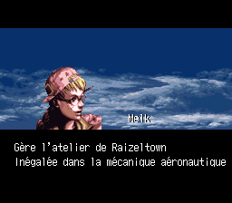

# Treasure Conflix - French

French translation for the Satellaview (SNES/Super Famicom) game トレジャーコンフリクス (Treasure Conflix) released in 1996 by Squaresoft. 

# French patch

### Screenshots

### BPS Patch

-- February 2023 --\
Patch file v1.0 is available here : [BS Treasure Conflix (French) 1.0.zip](/patch/1.0/BS%20Treasure%20Conflix%20(French)%201.0.zip) 

Soon available on romhacking.net 

It applies to the following ROM :\
File: BS Treasure Conflix\
No-Intro: Super Nintendo Entertainment System (v. 20180813-062835)\
ROM SHA-1: DFF1D22D662FED96F45AC3E722C79C93469CA421\
ROM CRC32: F50FB0B7\

Tested with the following Satellaview bios: BS-X BIOS (English) [No DRM] [2016 v1.3]

More info about the Satellaview:  [https://project.satellaview.org/downloads.htm](https://project.satellaview.org/downloads.htm) 

## Disclaimer

